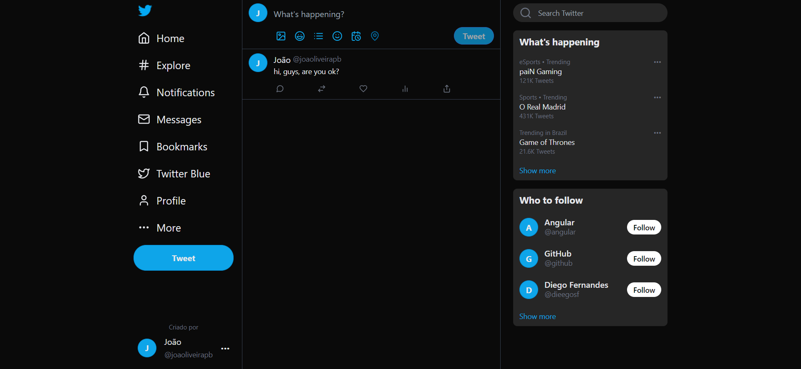

# Clone Twitter

O projeto Clone do Twitter foi desenvolvido para impulsionar meus conhecimentos em Angular e Tailwind CSS.

Assim como o Twitter original, esse clone faz publicações de tweets.

## Screenshots

[🔗 Clique aqui para acessar](https://clone-twitter-roan.vercel.app/)

## 🛠️ Tecnologias

- Angular
- Tailwind CSS
- TypeScript
- JavaScript
- Lucide

## 💙 Contato
Criado por João Oliveira

